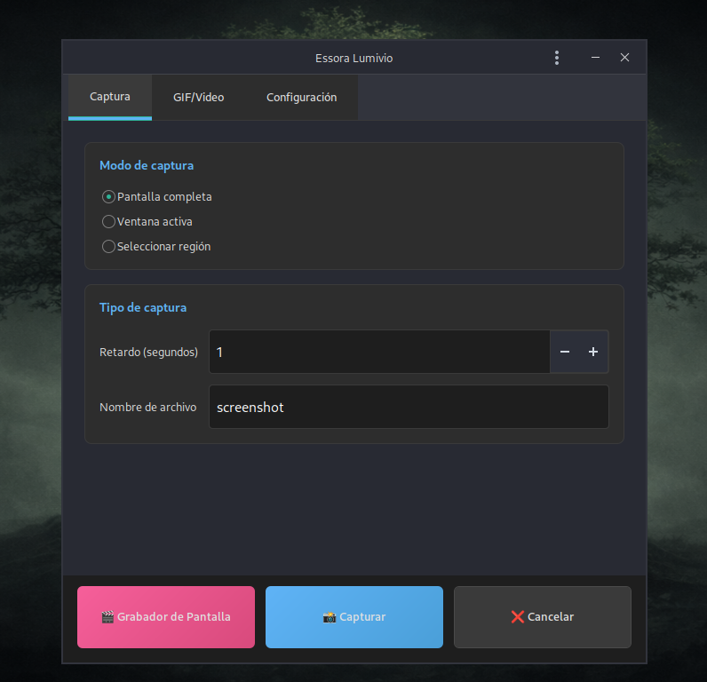

# Lumivio
Screen capture tool for screenshots (PNG), region GIF recording, and full-screen video recording with a clean GTK3 interface.

<p align="center">
  
</p>

Lumivio is an Essora utility created by **josejp2424**. It focuses on fast, simple screen capture workflows using common Linux tools (FFmpeg, scrot, slop).

## Features

- Take screenshots and save as **PNG** (with optional delay).
- Record a selected screen region and export as **GIF** (FFmpeg palette mode).
- Record **full-screen video** (X11, via FFmpeg `x11grab`).
- Optional recording controller (`Screen_Recorder.py`) for start/pause/stop workflows.

## Dependencies (Debian/Devuan)

Core runtime dependencies:

```bash
sudo apt update
sudo apt install -y   python3 python3-gi gir1.2-gtk-3.0   python3-cairo python3-gi-cairo   gir1.2-gdkpixbuf-2.0 librsvg2-common   ffmpeg scrot slop imagemagick   xdg-utils pulseaudio-utils
```

Notes:
- Lumivio is designed for **X11** (it uses FFmpeg `x11grab`).
- `pulseaudio-utils` provides `pactl` (used for audio device detection in recording).

## Install (from this repository)

This repo keeps the original Essora paths:

- App files: `/usr/local/Lumivio/`
- Desktop entry: `/usr/share/applications/lumivio.desktop`
- CLI launcher: `/usr/local/bin/lumivio`

Install:

1. `cd /path/to/Lumivio`
2. `sudo make install`

Uninstall:

- `sudo make uninstall`

## Usage

Launch from the application menu (Screen Capture Tool), or run:

```bash
lumivio
```

You can also start the recording controller directly:

```bash
python3 /usr/local/Lumivio/Screen_Recorder.py
```

## License

GPL-3.0. See headers in the source code.
